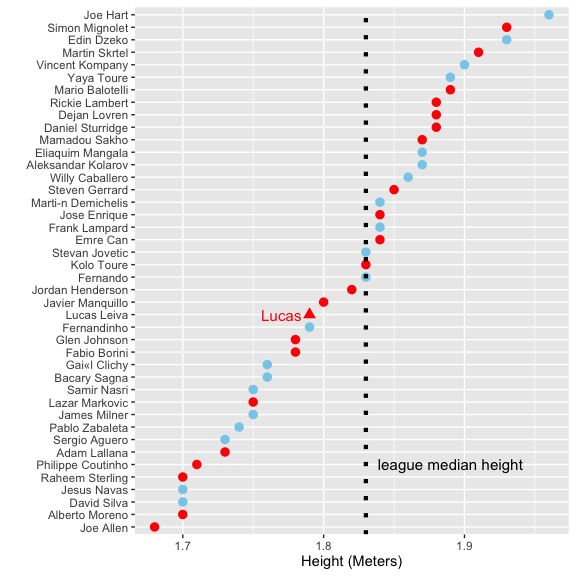

# Data Analysis: Lucas Leiva's Height Compared to LFC and MCFC Squad

Lucas Leiva played as a center half in the 2016 Capitol One Cup final. How does 
his height compare to the rest of the players?

Load packages:

```r
library(ggplot2)
library(dplyr)
```

Read in the player height data from this [Guardian article](http://www.mirror.co.uk/sport/football/news/tall-short-it-how-premier-4503094). The direct link to the raw data was misbehaving, so I included the .csv in
the repo. Just know that it's available in the link above in the interactive
search area. You may need to do a search to make the link appear.


```r
# data-jX2NV.csv must be in the working directory.
setwd("~/Documents/github/epl_player_height")

# Read dataset
df <- read.csv("data-jX2NV.csv", stringsAsFactors = FALSE)
```

Clean the dataset and subset for just the LFC and MUFC squads. Add a logical 
value for Lucas:


```r
# Rename columns and subset data
df2 <- df %>%
  rename("Height" = Height..m.) %>%
  arrange(desc(Height)) %>%
  filter(Club == "Liverpool" | Club == "Manchester City") %>%
  mutate(Lucas = Player == "Lucas Leiva")
```
  
This is the plot:

### How Tall is Lucas?
Lucas ranks 25th out of 42 players on the Liverpool and Manchester City squads of the 2014-2015 season.  
data: [http://www.mirror.co.uk/sport/football/news/tall-short-it-how-premier-4503094](http://www.mirror.co.uk/sport/football/news/tall-short-it-how-premier-4503094)


```r
# Plot
ggplot(df2, aes(x = Height, y = reorder(Player, Height), color = Lucas)) +
  geom_point(size = 3) +
  scale_color_manual(values = c("grey", "hotpink3")) +
  guides(color = FALSE) +
  labs(x = "Height (Meters)", y = "")
```



By [RyanEs on Twitter](https://twitter.com/RyanEs)
